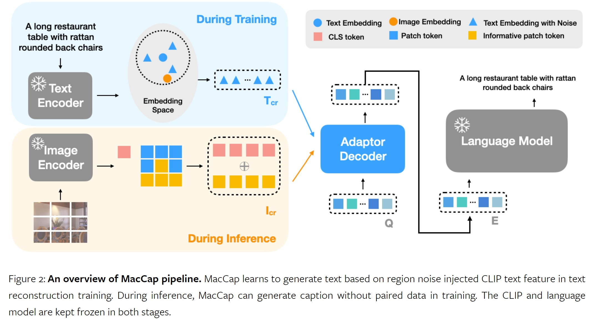

# MacCap
AAAI 2024 Accepted Paper [Mining Fine-Grained Image-Text Alignment for Zero-Shot Captioning via Text-Only Training](https://arxiv.org/abs/2401.02347v1)



## Setup

First, download and set up the repo:

```bash
git clone https://github.com/Artanic30/MacCap
cd MacCap
conda env create -f environment.yml
conda activate MacCap
```

## Data preparation

Download [coco_train](https://drive.google.com/file/d/1k4LlhgwnvpkUlzQjtTomnDFvlkboTxOH/view?usp=share_link) to `data`.
Download [cc3m_train](https://drive.google.com/file/d/1-xfOLJasBTqTrSnsyAncKSfsjSSN5RTH/view?usp=share_link) to `data`.

## Training

```
./train_coco.sh
```
or 
```
./train_cc3m.sh
```


## Evaluation
Follow the instruction [here](https://github.com/tylin/coco-caption) to evaluate generated captions.


## Citation
```
@article{qiu2024mining,
  title={Mining Fine-Grained Image-Text Alignment for Zero-Shot Captioning via Text-Only Training},
  author={Qiu, Longtian and Ning, Shan and He, Xuming},
  journal={arXiv preprint arXiv:2401.02347},
  year={2024}
}
```

## Acknowledgments
This repository is heavily based on [ClipCap](https://github.com/rmokady/CLIP_prefix_caption), [DeCap](https://github.com/dhg-wei/DeCap).
For training we used the data of [COCO dataset](https://cocodataset.org/#home) and [Conceptual Captions](https://ai.google.com/research/ConceptualCaptions/).


## Release Schedule

- [x] Initial Code release
- [x] Detail Document
- [x] Data Preparation
- [x] Training and Evaluation Scripts
- [ ] Checkpoints